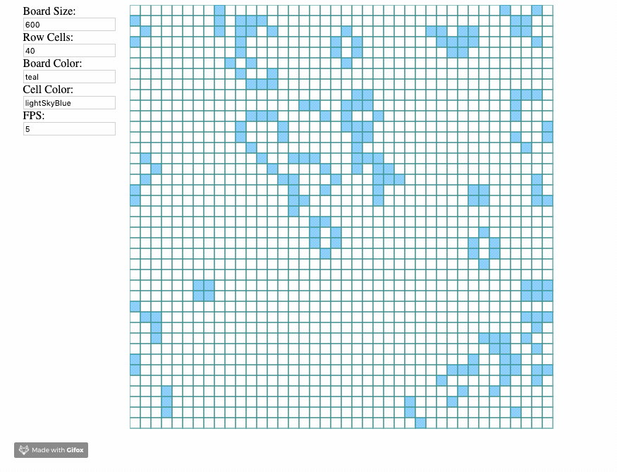

# Game of Life

## Demo Screenshot

## Rules
- Given a board with m by n cells, each cell has an initial state live (1) or dead (0).
- Each cel interacts with its 8 neighbours using the following 4 rules:
    - 1) any live cell with fewer than 2 live neighbours dies, as if caused by under-population
    - 2) any live cell with 2 or 3 live neighbours lives on to the next generation
    - 3) any live cell with more than 3 live neighbours dies, as if by over-population
    - 4) any dead cell with exactly 3 live neighbours becomes a live cell, as if by reproduction
